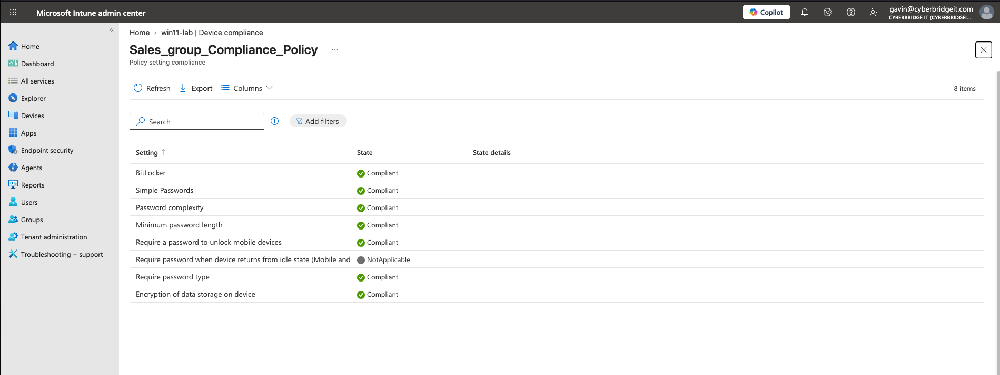
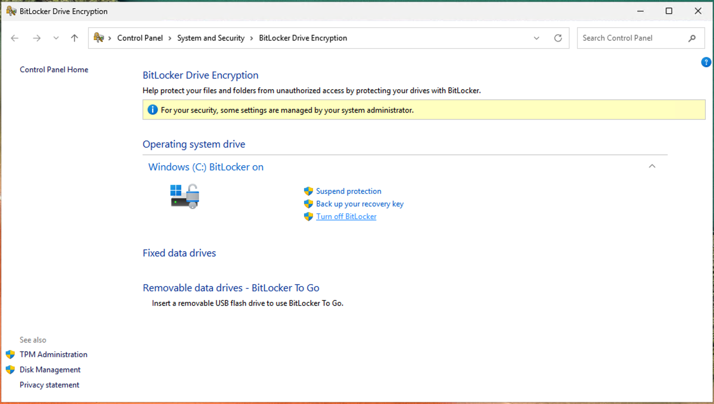
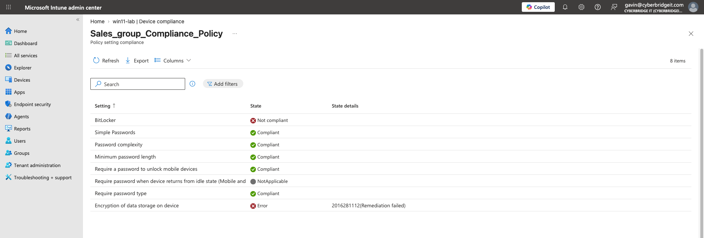
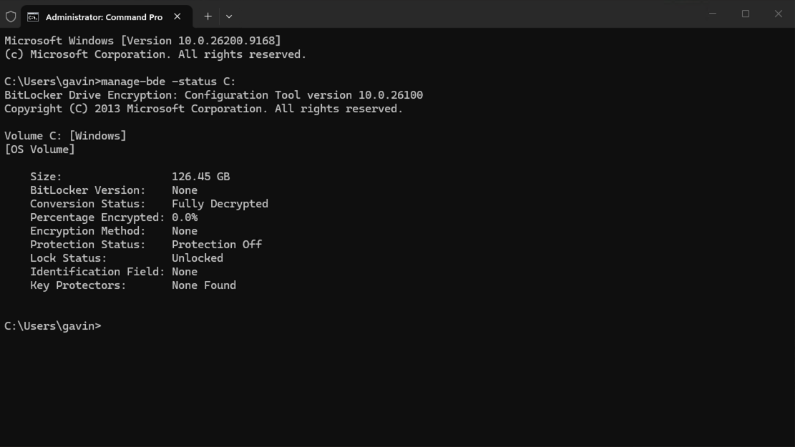
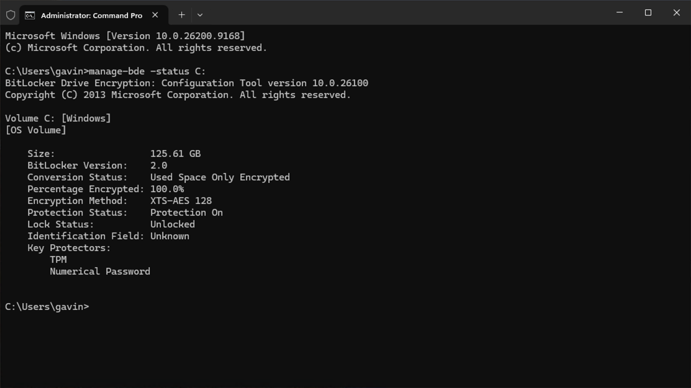
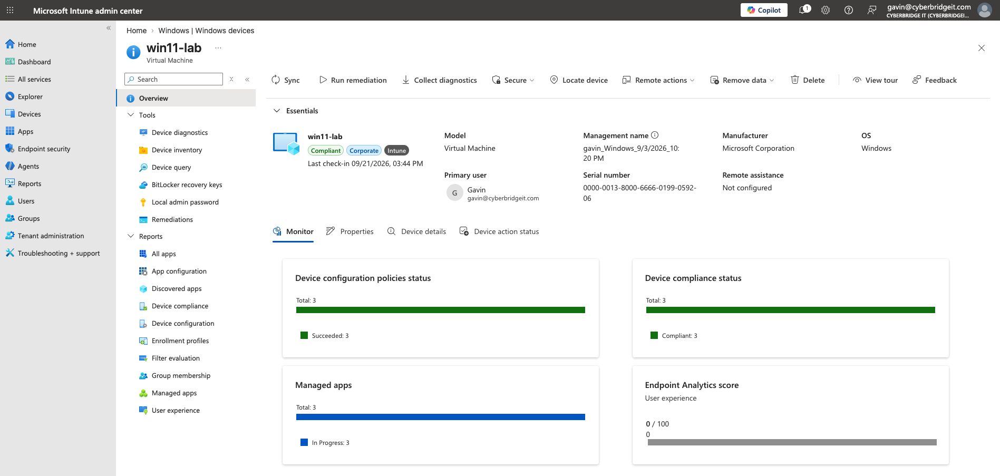
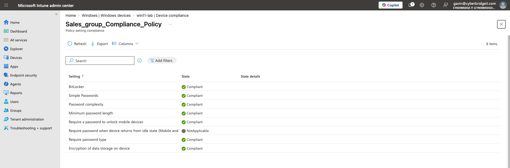
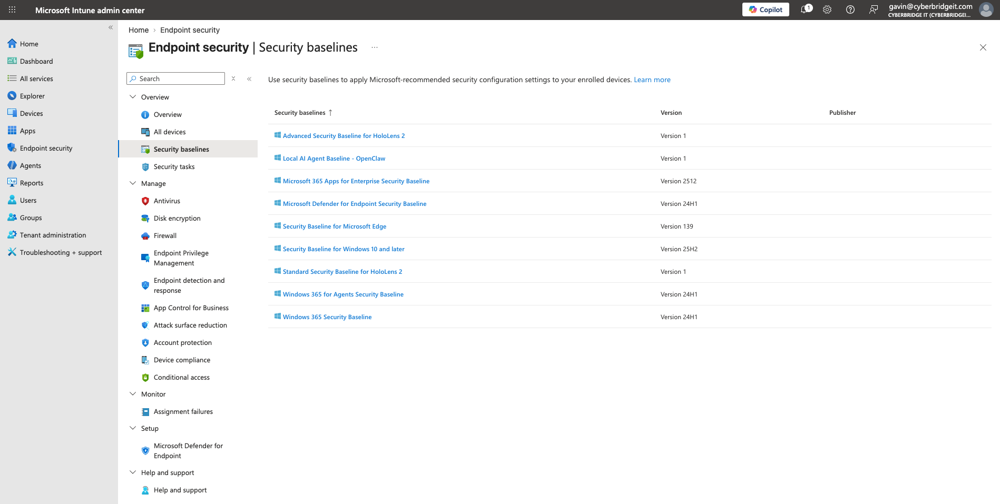
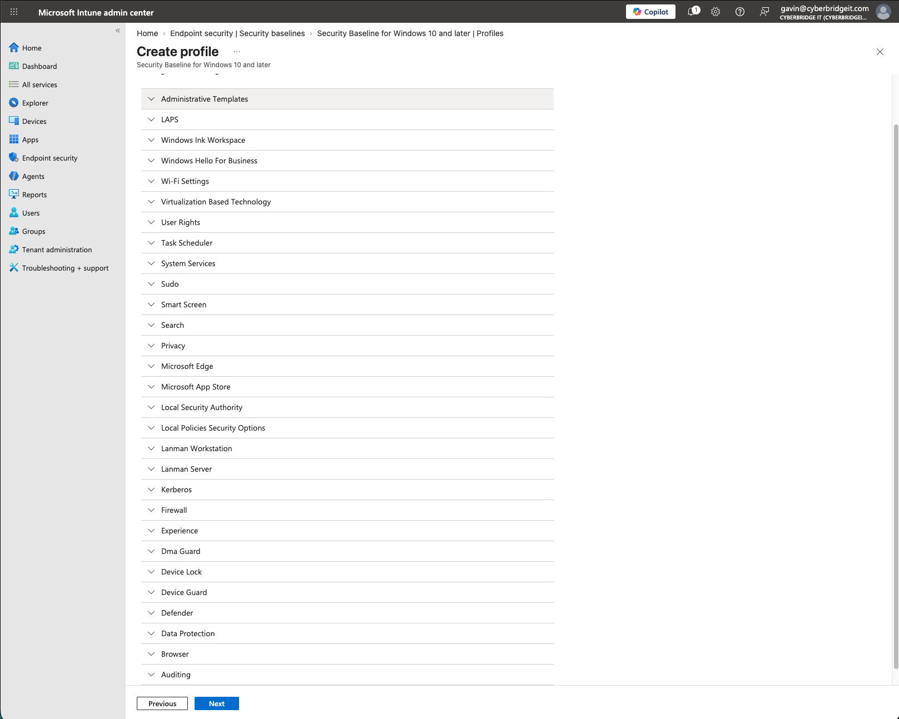
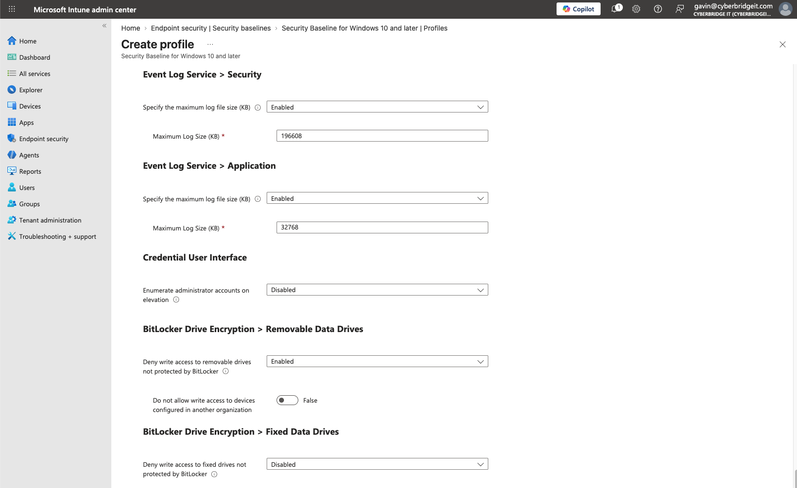

# BitLocker Compliance Failure and Remediation Evidence

Supporting evidence for the [BitLocker Compliance Failure and Remediation](../../case-studies/02-bitlocker-compliance-failure-and-remediation.md) case study.

## Evidence 1: Compliant State Before the Change

Before the controlled change, Intune reported BitLocker and device-storage encryption as compliant.

## Evidence 2: BitLocker Turn-Off Control

The Windows BitLocker management interface provided the **Turn off BitLocker** control used to initiate the controlled compliance failure.

## Evidence 3: Local BitLocker Failure State

The local `manage-bde -status C:` output confirmed that the operating-system drive was fully decrypted, 0% encrypted, and had BitLocker protection turned off.

## Evidence 4: Intune Noncompliance Detection

Intune reported BitLocker as **Not compliant**. The device-storage encryption requirement also displayed an error with a remediation-failed status.

## Evidence 5: Local BitLocker Restoration

After remediation, `manage-bde -status C:` showed:

- Used Space Only Encrypted
- 100.0% encrypted
- XTS-AES 128
- Protection On
- TPM and Numerical Password key protectors

## Evidence 6: Overall Device Compliance Restored

The Intune device overview reported `win11-lab` as compliant after BitLocker was restored and the device state was reevaluated.

## Evidence 7: Encryption Controls Compliant

The detailed compliance-policy view showed both BitLocker and device-storage encryption as compliant after remediation.

## Evidence 8: Windows Security Baseline Selection

The Security Baseline for Windows 10 and later was selected for the preventive-control review.

## Evidence 9: Security-Baseline Category Selection

The profile-creation workflow presented the configuration categories used to locate and review the relevant endpoint-protection settings.

## Evidence 10: Fixed-Drive BitLocker Setting

The baseline configuration showed different controls for removable and fixed data drives:

- Deny write access to removable drives not protected by BitLocker: **Enabled**
- Deny write access to fixed drives not protected by BitLocker: **Disabled**

The fixed-drive setting was reviewed as a possible preventive control. It was not deployed during this activity.

## Privacy Note

User email addresses and unique device identifiers were redacted before publication. All activity was performed on an authorized lab virtual machine.
