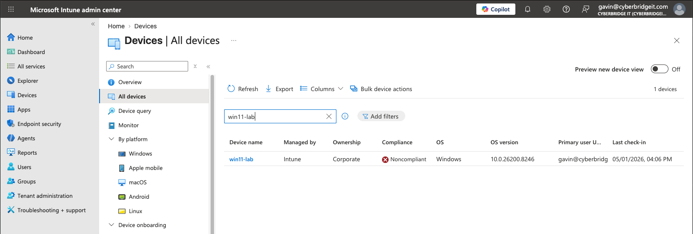
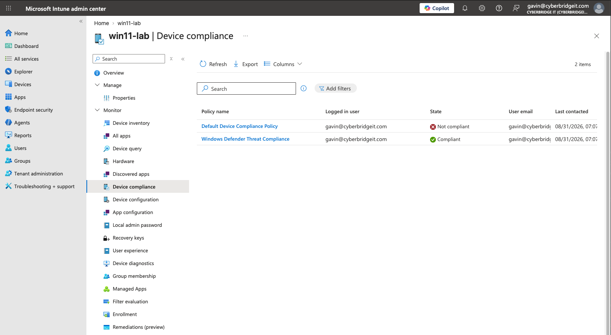
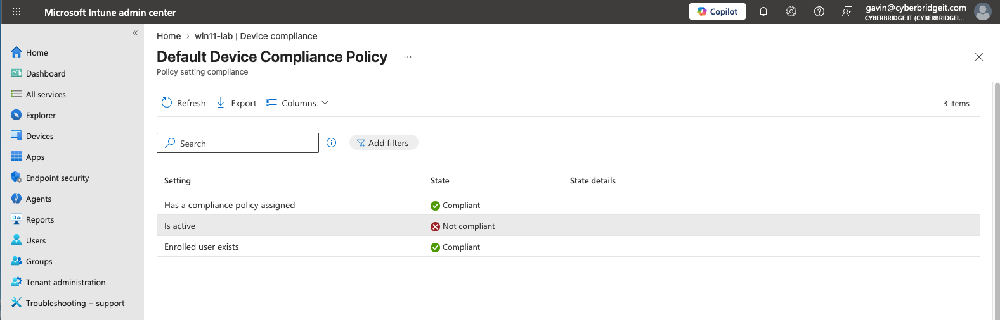

# Device Enrollment and Compliance Evidence

Supporting evidence for the [Device Enrollment and Compliance Assessment](../../case-studies/01-device-enrollment-and-compliance-assessment.md).

## Evidence 1: Intune Device Enrollment Status

The Intune device inventory shows `win11-lab` as a corporate Windows device managed by Intune. Its overall compliance state is reported as **Noncompliant**.

## Evidence 2: Device Compliance Policy Results

The device compliance view shows two different policy results:

- Default Device Compliance Policy: **Not compliant**
- Windows Defender Threat Compliance: **Compliant**

This demonstrates why the overall device status must be investigated at the individual policy level.

## Evidence 3: Default Compliance Policy Failure

The Default Device Compliance Policy details identify `Is active` as the failed setting. The device had a compliance policy assigned and an enrolled user, but it did not satisfy the activity-related evaluation.

## Privacy Note

User email addresses were redacted before publication. All activity was performed in an authorized lab environment.
