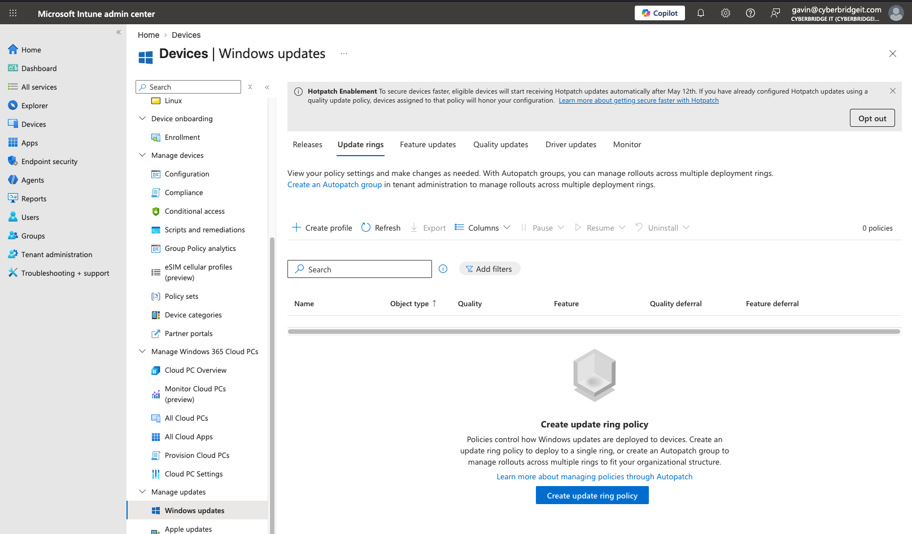
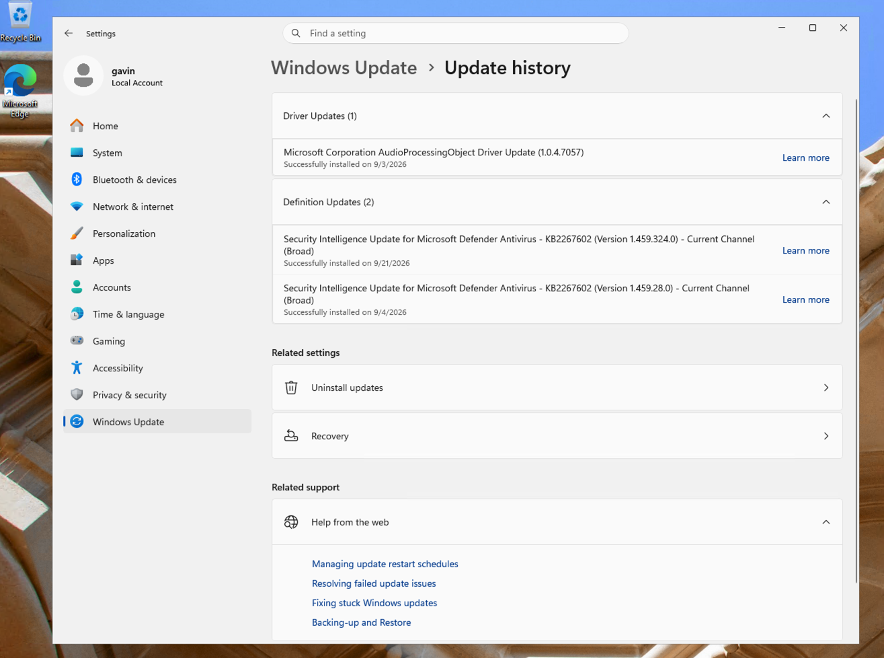
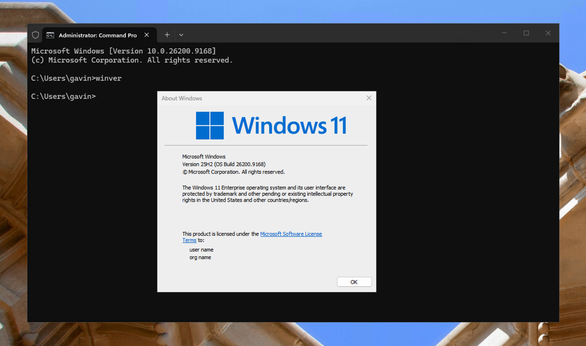
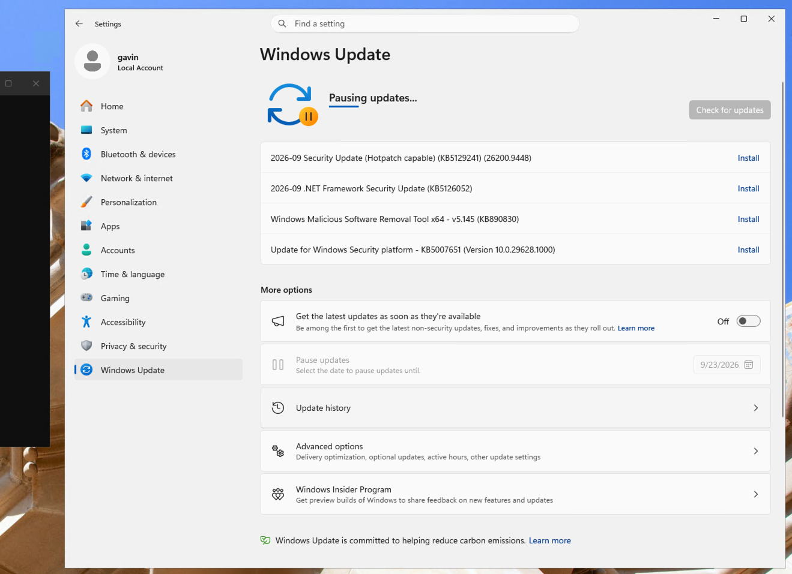
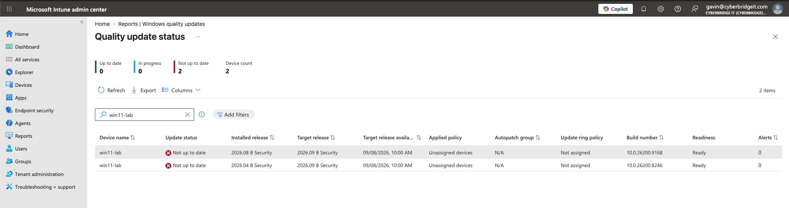
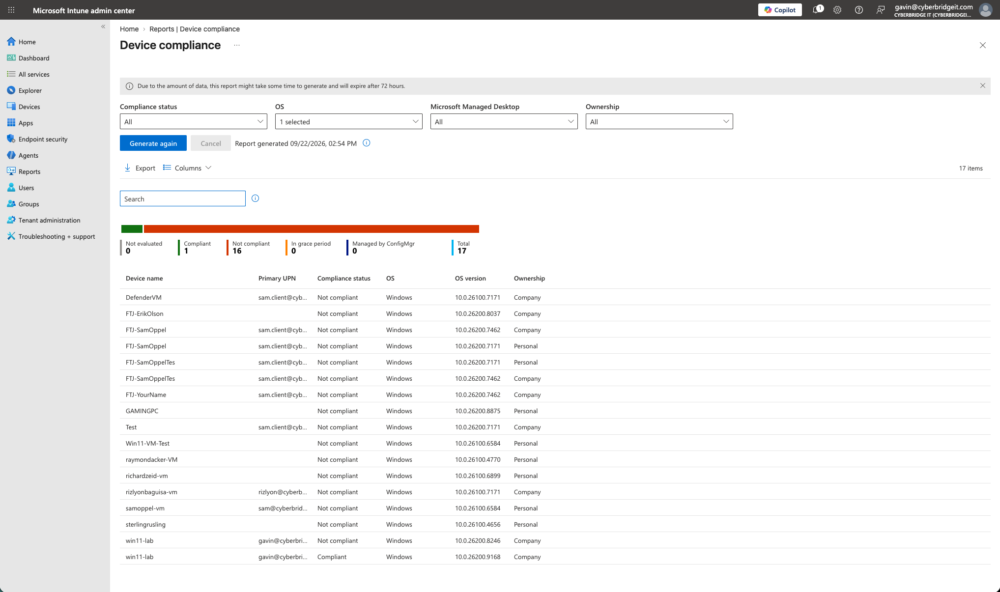

# Windows Update Compliance and Patch Risk Evidence

Supporting evidence for the [Windows Update Compliance and Patch Risk Investigation](../../case-studies/03-windows-update-compliance-and-patch-risk.md).

## Evidence 1: No Update Rings Configured

The Intune Windows Update rings page showed zero configured policies. The current endpoint therefore did not have centrally defined update deferrals, deadlines, grace periods, or restart behavior from an update-ring policy.

## Evidence 2: Windows Update History

The local Windows Update history displayed driver and Microsoft Defender definition updates. No quality update appeared in the visible update history.

## Evidence 3: Current Windows Build

The `winver` command confirmed that the current `win11-lab` virtual machine was running Windows 11 version 25H2, OS build `26200.9168`.

## Evidence 4: Paused Updates and Pending Security Update

Windows Update showed the procedural update pause and several pending updates, including the September 2026 security update.

Updates were resumed after the evidence was collected.

## Evidence 5: Intune Quality Update Status

The Windows Quality Update Status report marked the current `win11-lab` record as **Not up to date**.

The current record showed:

- Installed release: `2026.08 B Security`
- Target release: `2026.09 B Security`
- Build number: `10.0.26200.9168`
- Update-ring policy: Not assigned

The report also contained a historical `win11-lab` record on build `10.0.26200.8246`. That record belonged to an earlier lab VM that had been deleted and was excluded from conclusions about the current endpoint.

## Evidence 6: Organization-Wide Device Compliance

The organization-wide Device Compliance report showed:

- 17 device records
- 1 compliant record
- 16 noncompliant records

The current `win11-lab` record on build `10.0.26200.9168` was compliant. The historical record on build `10.0.26200.8246` was noncompliant.

This comparison demonstrated that the current endpoint could satisfy its assigned device-compliance policies while still being behind the target Windows security release.

## Lab Context

The investigation used the current `win11-lab` virtual machine on build `10.0.26200.9168`. Historical records from the previously deleted lab VM were identified by their older build number and excluded from current-state conclusions.
